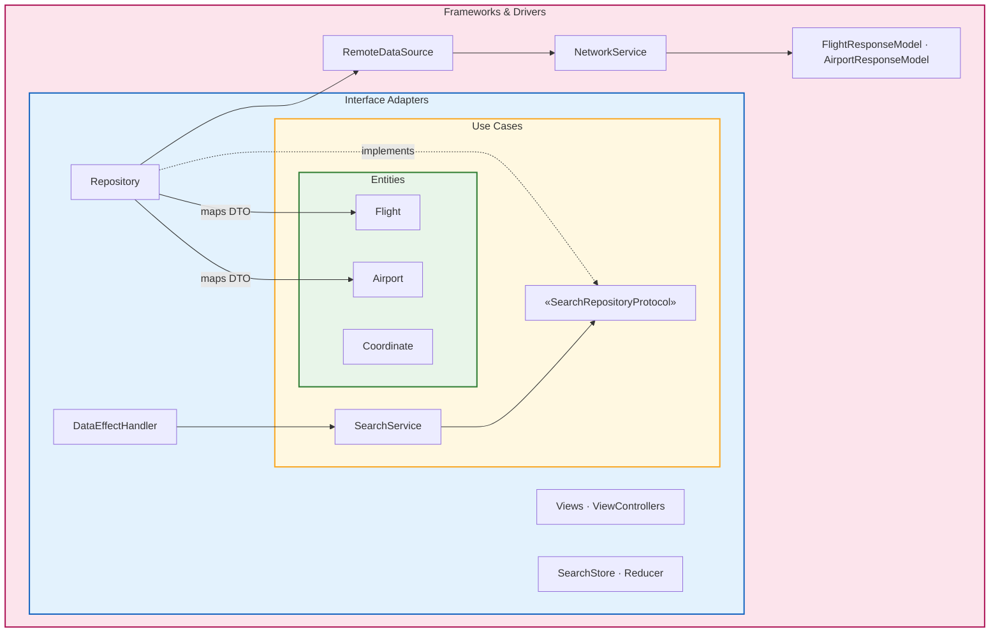
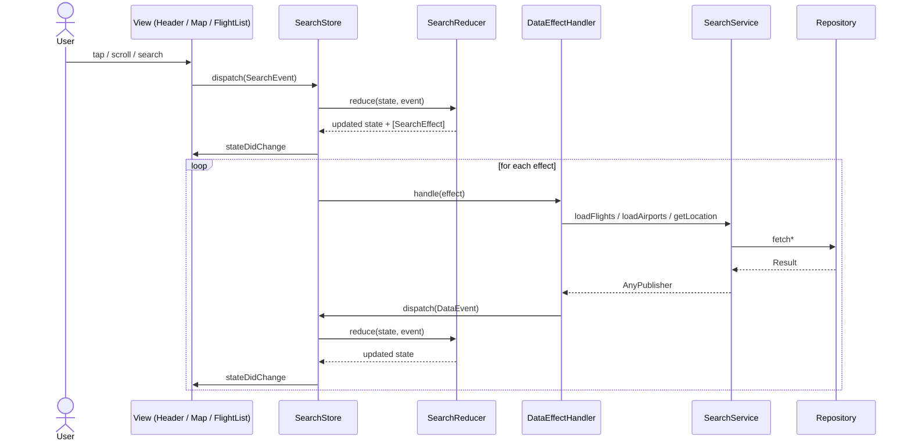

# Flight Demo

iOS demo app for browsing flights on an interactive map. Built with UIKit, [Clean Architecture](https://blog.cleancoder.com/uncle-bob/2012/08/13/the-clean-architecture.html), and a unidirectional data flow on the presentation layer. The Xcode project is generated with [Tuist](https://tuist.dev) from `Project.swift` and is not committed to the repository.

## Features

- **Interactive map** — airport markers on MapKit with custom annotation views
- **Flight list** — searchable list with shimmer loading, empty and error states
- **Custom bottom sheet** — draggable sheet with multiple detents and animated header transitions
- **Remote data** — flights and airports loaded from a mock REST API
- **Flight status badges** — visual highlights for special offers (e.g. best price)
- **Localization** — UI strings in English, Russian, and Spanish

## Tech Stack

| Layer | Technologies |
|---|---|
| UI | UIKit, MapKit, SnapKit |
| State | Custom Store + Reducer, Combine |
| Networking | URLSession, async/await |
| Architecture | Clean Architecture, Coordinator, Assembly (DI), Repository |
| Tooling | Tuist 4.22, XCTest, Fastlane |

## Architecture

The project follows **Clean Architecture**: dependencies point inward, and inner layers know nothing about UI, networking, or frameworks. The presentation layer adds a **unidirectional data flow** (Store + Reducer + Effects) on top of use cases for predictable UI state.

### Clean Architecture Layers

Rings are nested from the inside out — outer layers depend on inner ones, never the reverse:



| Clean Architecture ring | Project location | Key types |
|---|---|---|
| **Entities** | `Development/Models/Domain/` | `Flight`, `Airport`, `Coordinate` |
| **Use Cases** | `Development/Modules/Search/Service/` | `SearchService`, `SearchServiceProtocol` |
| **Interface Adapters** | `Development/Services/Repository/`, `Development/Modules/Search/` | `Repository`, `SearchStore`, `SearchReducer`, views |
| **Frameworks & Drivers** | `Development/Services/Remote/`, `Development/Services/NetworkService/` | `RemoteDataSource`, `NetworkService`, `*ResponseModel` |

The **dependency rule** is enforced through protocols: `SearchService` depends on `SearchRepositoryProtocol`, not on `Repository` or `RemoteDataSource`. Domain entities never import UIKit or URLSession.

### Entity Examples

Domain models live in `Development/Models/Domain/` and represent business concepts. Infrastructure DTOs in `Development/Models/Remote/Response/` mirror the API shape. Mapping happens at the repository boundary — entities stay independent of transport details.

**DTO** — raw API payload, `Decodable`:

```swift
// Development/Models/Remote/Response/FlightResponseModel.swift
struct FlightResponseModel: Decodable {
    let id: String
    let airline: AirlineResponseModel
    let price: Decimal
    let status: StatusResponseModel?  // "best_price" from JSON
    // ...
}
```

**Entity** — domain model with typed business semantics:

```swift
// Development/Models/Domain/Search/Flight.swift
struct Flight: Equatable {
    let id: String
    let airline: Airline
    let price: Decimal
    let status: Status?  // .bestPrice, .recommended, .fastest

    init(from model: FlightResponseModel) {
        self.id = model.id
        self.airline = Airline(from: model.airline)
        self.price = model.price
        self.status = model.status.flatMap { Status(from: $0) }
    }
}
```

**Mapping** — `Repository` converts DTOs into entities before returning them to use cases:

```swift
// Development/Services/Repository/Repository.swift
func fetchFlights() async -> Result<[Flight], Error> {
    let result = await remoteDataSource.fetchFlights()
    switch result {
    case let .success(responseModels):
        return .success(responseModels.map { Flight(from: $0) })
    case let .failure(error):
        return .failure(error)
    }
}
```

The same pattern applies to airports: `AirportResponseModel` (with `latitude` / `longitude` doubles) is mapped to `Airport` (with `CLLocationCoordinate2D` for the map).

### Unidirectional Data Flow



### Presentation Layer

Within the Search module, UI state is managed with a Store + Reducer pattern:

| Concern | Key types |
|---|---|
| **App bootstrap** | `AppDelegate`, `SearchFlowCoordinator` |
| **Views** | `SearchViewController`, `SearchHeaderView`, `SearchMapViewController`, `SearchFlightListView` |
| **State management** | `SearchStore`, `SearchReducer`, `SearchEvent`, `SearchEffect`, `SearchState` |
| **Side effects → use cases** | `DataEffectHandler` calls `SearchService` and dispatches results back as events |

### Design Patterns

- **Store + Reducer + Effects** — predictable state updates; reducer is pure and easily testable
- **Coordinator** — navigation is decoupled from view controllers (`SearchFlowCoordinator`)
- **Assembly** — dependency graph is wired in one place (`SearchAssembly`)
- **Repository** — abstracts data sources behind `SearchRepositoryProtocol`
- **ConfigurableView** — views are driven by `Equatable` configuration structs instead of imperative property setters
- **Configuration Factory** — maps `SearchState` slices into view configurations, keeping views thin

## Requirements

- Xcode 16+
- [Tuist](https://docs.tuist.dev/guides/quick-start/install-tuist) 4.22.0 (see [`.tuist-version`](.tuist-version))
- Ruby + [Bundler](https://bundler.io) (for Fastlane)

## Getting Started

```bash
git clone git@github.com:IvanPuzanov/FlightApp.git
cd FlightApp
bundle install
tuist generate
open FlightDemoApp.xcworkspace
```

Build and run the `FlightDemoApp` scheme in Xcode.

## Fastlane

[Fastlane](https://fastlane.tools) automates build and test commands. Configuration lives in [`fastlane/Fastfile`](fastlane/Fastfile). Every lane runs `tuist generate` first, so the workspace is always up to date.

| Lane | Description |
|---|---|
| `generate` | Generate the Xcode workspace via Tuist |
| `build` | Compile the app for the iOS Simulator (build verification) |
| `test` | Run unit tests from a test plan (default: `UnitTests`) |

```bash
# Build verification
bundle exec fastlane build

# Run unit tests on the default simulator (iPhone 16 Pro)
bundle exec fastlane test

# Run a specific test plan on a specific device
bundle exec fastlane test testplan:UnitTests device:"iPhone 17 Pro"

# Clean build
bundle exec fastlane build clean:true
```

Lane options can also be passed via environment variables: `DEVICE`, `TEST_PLAN`.

Fastlane artifacts (`report.xml`, `test_output/`, etc.) are gitignored and cleaned up automatically after `test` runs.

## Notes

- After pulling changes that touch `Project.swift` or [`.package.resolved`](.package.resolved), run `tuist generate` again.
- Update `DEVELOPMENT_TEAM` in [`Project.swift`](Project.swift) if you need to run on a physical device with your own Apple Developer account.
- Flight and airport data is fetched from the [FlightAppMockAPI](https://github.com/IvanPuzanov/FlightAppMockAPI) repository. The app requires network access to load content.
- Localization strings live in `Development/App/*.lproj/Localizable.strings` and are exposed via Tuist's strings synthesizer as `FlightDemoAppStrings`.
