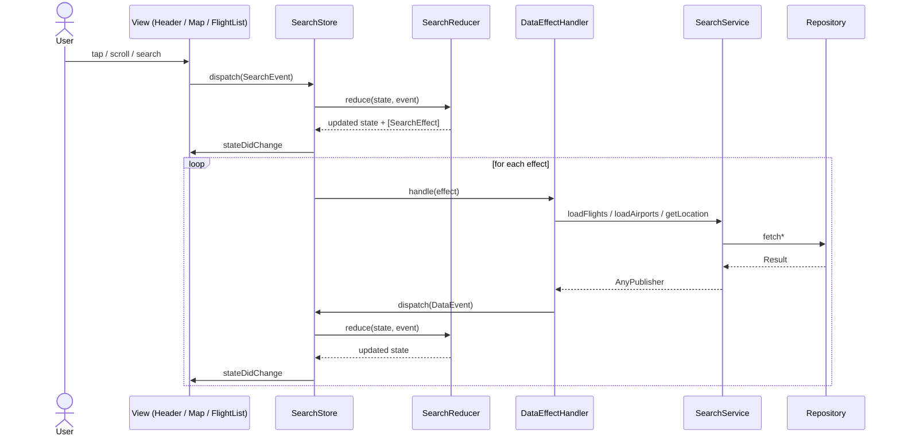

# Flight Demo

iOS demo app for browsing flights on an interactive map. Built with UIKit and a unidirectional data flow architecture. The Xcode project is generated with [Tuist](https://tuist.dev) from `Project.swift` and is not committed to the repository.

## Features

- **Interactive map** — airport markers on MapKit with custom annotation views
- **Flight list** — searchable list with shimmer loading, empty and error states
- **Custom bottom sheet** — draggable sheet with multiple detents and animated header transitions
- **Local data** — flights and airports loaded from bundled JSON assets

## Tech Stack

| Layer | Technologies |
|---|---|
| UI | UIKit, MapKit, SnapKit |
| State | Custom Store + Reducer, Combine |
| Architecture | Coordinator, Assembly (DI), Repository |
| Tooling | Tuist 4.22, XCTest |

## Architecture

The app follows a **layered, unidirectional data flow** inspired by Elm / Redux. UI dispatches events, a pure reducer updates state and returns side effects, and effect handlers perform async work and feed results back as new events.

### Unidirectional Data Flow



### Layers

| Layer | Responsibility | Key types |
|---|---|---|
| **App** | App lifecycle, navigation bootstrap | `AppDelegate`, `SearchFlowCoordinator` |
| **Presentation** | UI rendering, user input → events | `SearchViewController`, `SearchHeaderView`, `SearchMapViewController`, `SearchFlightListView` |
| **State** | Single source of truth, pure state transitions | `SearchStore`, `SearchReducer`, `SearchEvent`, `SearchEffect`, `SearchState` |
| **Domain** | Business logic, async API surface | `SearchService` |
| **Data** | Data access, mapping DTO → domain models | `Repository`, `LocalDataSource`, `LocationService` |

### Design Patterns

- **Store + Reducer + Effects** — predictable state updates; reducer is pure and easily testable
- **Coordinator** — navigation is decoupled from view controllers (`SearchFlowCoordinator`)
- **Assembly** — dependency graph is wired in one place (`SearchAssembly`)
- **Repository** — abstracts data sources behind `SearchRepositoryProtocol`
- **ConfigurableView** — views are driven by `Equatable` configuration structs instead of imperative property setters
- **Configuration Factory** — maps `SearchState` slices into view configurations, keeping views thin

## Requirements

- Xcode 16+
- [Tuist](https://docs.tuist.dev/guides/quick-start/install-tuist) 4.22.0 (see [`.tuist-version`](.tuist-version))

## Getting Started

```bash
git clone git@github.com:IvanPuzanov/flightApp.git
cd flightApp
tuist generate
open FlightDemoApp.xcworkspace
```

Build and run the `FlightDemoApp` scheme in Xcode.

## Tests

```bash
tuist generate
xcodebuild test \
  -workspace FlightDemoApp.xcworkspace \
  -scheme FlightDemoApp \
  -destination 'platform=iOS Simulator,name=iPhone 17 Pro'
```

Or press `Cmd+U` in Xcode.

## Notes

- After pulling changes that touch `Project.swift` or [`.package.resolved`](.package.resolved), run `tuist generate` again.
- Update `DEVELOPMENT_TEAM` in [`Project.swift`](Project.swift) if you need to run on a physical device with your own Apple Developer account.
